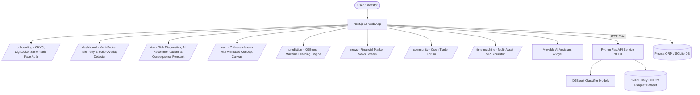

# Unify — All Your Investments, In One Place 🚀

> A unified wealth management telemetry platform, Government CKYC onboarding pipeline, live WebRTC biometric face authentication, XGBoost machine learning stock prediction service, multi-asset risk analytics engine, interactive financial masterclasses with visual concept metaphors, animated market news stream, and movable AI assistant.

[](https://nextjs.org/)
[](https://www.typescriptlang.org/)
[](https://fastapi.tiangolo.com/)
[](https://xgboost.readthedocs.io/)
[](https://tailwindcss.com/)
[](https://www.prisma.io/)

---

## 📌 Executive Summary & Problem Statement

Indian retail investors face severe portfolio fragmentation across multiple brokerage platforms (**Zerodha, Groww, Upstox, Angel One, ICICI Direct**). This structural fragmentation leads to critical inefficiencies:

1. **Depository Fee Leakage**: Holding identical scrips across multiple brokers drains investment capital via duplicate annual Depository Participant (DP) charges (~₹420/year per duplicated scrip).
2. **Opaque Multi-Asset Risk Exposure**: Inability to calculate true overall portfolio volatility, Herfindahl-Hirschman asset concentration, and Value-at-Risk (VaR) across segregated accounts.
3. **Speculative Decision Making**: Excessive reliance on unverified social media noise rather than statistical machine learning directional probabilities and technical indicator models.
4. **Financial Education Gap**: Complex asset classes (REITs, InvITs, Corporate/Government Bonds, Index ETFs, Futures & Options) are poorly understood by retail investors.

### 💡 The Unify Solution

**Unify** aggregates live telemetry across all brokerage accounts into a single real-time dashboard. The platform integrates **Government CKYC & Live Biometric Face Verification**, an **XGBoost Machine Learning Stock Prediction Microservice**, a **7-Domain Risk Engine with Future Consequence Forecasting**, **Interactive Masterclasses featuring Visual Metaphors & Animated Avatars**, an **Animated Market News Experience**, and a **Movable AI Assistant**.

---

## ✨ Core Platform Modules & Features

### 1. 🆔 Government CKYC & Biometric Identity Onboarding (`/onboarding`)
- **8-Step Verification Workflow**:
  1. **Investor Profile**: Collects personal details with keyboard `<Enter>` key navigation.
  2. **NSDL Depository PAN Verification**: Live NSDL PAN lookup featuring official NSDL branding.
  3. **Mobile OTP Authentication**: 6-digit OTP verification with instant demo bypass.
  4. **DigiLocker & UIDAI Aadhaar CKYC**: Redirects to `digilocker.gov.in` for authorized CKYC data retrieval featuring official UIDAI Aadhaar branding.
  5. **WebRTC Camera Live Biometric Face Auth**: Real camera feed integration, face mesh alignment ring, laser scanner animation, and biometric hash match against Aadhaar records.
  6. **Multi-Broker Connection & P&L File Inspection**:
     - Connection checkboxes for partnered (`Zerodha`, `Groww`, `Upstox`, `CDSL`) and un-integrated (`Angel One`, `ICICI Direct`) brokerages.
     - **Client-Side Financial P&L Validator**: Inspects uploaded files (`.pdf`, `.csv`, `.xlsx`) against contract note keywords (`P&L`, `Tax`, `CAS`, `Holdings`, `ISIN`), blocking invalid/random files with clear alerts.
     - **Interactive P&L Download Guides**: Step-by-step instructions for obtaining P&L statements across Zerodha, Groww, Upstox, Angel One, and ICICI Direct.
     - **Gmail Trade Mail Sync Consent**: Read-only trade confirmation email parsing.
  7. **Trader Classification Assessment**: Evaluates risk tolerance and experience to classify investors as *Fresher*, *Beginner*, *Intermediate*, *Advanced*, or *Pro Trader*.

---

### 2. 📊 Unified Portfolio Dashboard (`/dashboard`)
- **Multi-Broker Telemetry Aggregation**: Aggregates net portfolio valuation, unrealized P&L, day change, and asset allocation across Zerodha, Groww, Upstox, and CDSL.
- **High-Contrast Broker Filter Pills**: Active purple filter pills with white typography and official broker logo badges (`Zerodha`, `Groww`, `Upstox`, `CDSL`, `Unify`).
- **Scrip Overlap & DP Fee Leak Detection**: Automatically flags duplicate stock holdings across different brokers and quantifies annual DP fee savings.
- **Capital Distribution & Asset Breakdown**: Recharts visual breakdown displaying net worth center and granular asset weighting.

---

### 3. 🛡️ Portfolio Risk Diagnostic & Advisory Engine (`/risk`)
- **Current Risk Diagnostic Report**: Evaluates overall portfolio risk level (*Low, Moderate, High*) alongside an Overall Risk Score (0–100) and explicit diagnosis narrative explaining risk origins.
- **6 Core Quantitative Risk Metrics**:
  - **Overall Risk Score (0–100)**: Weighted composite of 40% Volatility, 30% Concentration (HHI), 30% Max Drawdown, plus derivative leverage penalties.
  - **Annualized Volatility (σ)**: Standard deviation of return fluctuations over a 252-day trading year.
  - **95% 1-Month Value-at-Risk (VaR in ₹)**: Maximum estimated 30-day rupee loss at 95% confidence level.
  - **Maximum Historical Drawdown (MDD %)**: Worst peak-to-trough crash decline percentage.
  - **Herfindahl Concentration Index (HHI)**: Asset class over-concentration metric.
  - **Sharpe Risk Efficiency Ratio**: Excess return per unit of volatility above 6.5% risk-free rate.
- **Personalized AI Action Recommendations**: Specific model-grounded advice to neutralize equity volatility via Mutual Funds, lock in yield via Bonds & REITs, and eliminate derivative leverage drag.
- **Structured Strategy Action Blueprints**: Pre-configured personal choice strategy decisions (*Volatility Neutralizer, Fixed Income Shield, 7-Domain Master*) and fine-tuned numerical percentage controls.
- **Future Consequences & Impact Forecast**: Side-by-side comparison table forecasting Risk Score reduction, crash cushion protection, monthly loss saved, and Sharpe efficiency gains.
- **7x7 Cross-Asset Correlation Matrix (Σ)**: Full covariance and correlation matrix displaying asset co-movements across Stocks, MFs, ETFs, Bonds, REITs, InvITs, and F&O.

---

### 4. 🤖 XGBoost ML Stock Prediction Microservice (`/prediction`)
- **FastAPI Machine Learning Service**: Independent Python backend trained on **124,000+ daily OHLCV historical records** across 50 Indian equity tickers.
- **Strict Chronological Split**: 80/20 train/test split with zero future data leakage.
- **Feature Engineering Pipeline**: Computes 14-day RSI, 10/50 day Moving Average ratios, 20-day rolling volatility, lagged returns (`return_1d`, `return_5d`), and volume momentum.
- **Model Evaluation**: Generates next-day directional probabilities (Bullish/Bearish), test set accuracy vs. naïve baseline, precision, recall, F1-score, feature importances, and confusion matrix.

---

### 5. 📚 Interactive Financial Masterclasses (`/learn`, `/learn/[asset]`)
- **7 Core Asset Class Modules**: Dedicated masterclasses for **Stocks**, **Mutual Funds**, **ETFs**, **Bonds**, **REITs**, **InvITs**, and **Futures & Options (F&O)**.
- **Animated Learner Avatar & Concept Visualizers**:
  - Inquisitive learner avatar face (`🧑‍💻`) with floating question marks (`❓`) rising keyframe animation loops.
  - 🍕 **Pizza & Asset Basket Visualizer** (*Stocks, Mutual Funds, ETFs*): Interactive slice allocator with dynamic topping allocation and risk diversification meters.
  - 🏢 **REIT Skyscraper Floor Builder**: Dynamic floor stacking visualizer calculating rental yield income.
  - 🪙 **Bond Certificate & Coupon Drops**: Interactive coupon payout simulator dropping gold interest coins.
  - 🚗 **InvIT Infrastructure Highway Plaza**: Animated toll plaza with moving vehicles generating toll revenues.
  - 🛡️ **F&O Leverage Shield**: Interactive Call/Put position toggle with multiplier controls.
- **Minimalist 3D Asset Logos & MCQ Quizzes**: Minimalist 3D category badges and interactive knowledge check quizzes with instant explanations.

---

### 6. 📰 Animated Financial Market News Stream (`/news`)
- **Animated Page Entrance**: Intro animation with dynamic alerts, floating news bells, ticker beacons, and smooth page transition.
- **Curated Financial Publications**: Aggregates real-time news headlines from **Times of India (Business), Economic Times, Moneycontrol, Financial Express, and Reuters**.
- **Sentiment & Source Filters**: Tagged with directional sentiment indicators (*BULLISH / BEARISH / NEUTRAL*), impact level, and publication filters.

---

### 7. 💬 Movable Unify AI Assistant (`AssistantWidget.tsx`, `/api/chat`)
- **Draggable UI Panel**: Movable floating chat window equipped with drag handles, allowing users to drag the assistant anywhere on the viewport.
- **Rich Structured Typography**: Custom markdown parser rendering bold tags (`**bold**`), bullet points (`•`), numbered badges (`1.`), and clickable internal route pills (`/prediction`, `/risk`, `/learn`) with zero raw asterisks/stars.
- **Smart Conversational Intent Engine**: Handles polite pleasantries (*"Thank you for the guidance"*, *"thanks"*, *"got it"*) gracefully, while providing comprehensive financial advice for arbitrary questions.

---

### 8. 🌐 Open Trader Community Forum (`/community`)
- **Trader Discussion Platform**: Category-tagged discussion threads for posting market analysis, portfolio strategies, and trading questions.
- **Experience Level Filtering**: Filter posts by trader classifications (*Fresher, Beginner, Intermediate, Advanced, Pro*).

---

### 9. ⏰ Multi-Asset Time Machine Historical Simulator (`/time-machine`)
- **Historical Compounding Engine**: Simulates Lump Sum and Monthly SIP compounding growth across Equities, Bonds, REITs, InvITs, and Mutual Funds over custom date ranges.
- **Comprehensive Analytics**: Computes CAGR, Drawdown Profile (Pain Index), and calendar year returns.

---

## 💻 Tech Stack & System Architecture



### Stack Components
- **Frontend Framework**: Next.js 16 (App Router), React 19, TypeScript.
- **UI Styling & Motion**: Tailwind CSS v4, Framer Motion, Lucide Icons, Recharts.
- **Backend Machine Learning**: Python 3.9+, FastAPI, XGBoost, pandas, scikit-learn, Uvicorn.
- **Database & Data Storage**: Prisma ORM, SQLite (`dev.db`), Apache Parquet (`stocks_processed.parquet`).

---

## 🛠️ Local Installation & Setup Guide

### Prerequisites
- **Node.js**: v18.0 or higher
- **npm**: v9.0 or higher
- **Python**: v3.9 or higher

### Step 1: Clone Repository
```bash
git clone https://github.com/aadiitya2007/Hack_On_Tracks.git
cd Hack_On_Tracks
```

### Step 2: Install Frontend Dependencies & Database Setup
```bash
# Install Node modules
npm install

# Generate Prisma Client & Push Database Schema
npx prisma generate
npx prisma db push --accept-data-loss

# Seed Database with Initial Telemetry Data
npx tsx scripts/seed-prod.ts
```

### Step 3: Setup Python ML Service & Train Models
```bash
# Create & activate Python virtual environment
python3 -m venv data_venv
source data_venv/bin/activate

# Install Python ML requirements
pip install -r ml-service/requirements.txt

# Train XGBoost models on historical Parquet dataset
cd ml-service
python train.py
cd ..
```

### Step 4: Run Application Services

**Terminal 1: Start Next.js Development Server**
```bash
npm run dev
```
*Application interface will run at `http://localhost:3000`*

**Terminal 2: Start FastAPI ML Microservice**
```bash
source data_venv/bin/activate
cd ml-service
uvicorn main:app --host 0.0.0.0 --port 8000
```
*FastAPI ML microservice will run at `http://localhost:8000`*

---

## 📐 Risk Engine Mathematics & Formulas

The composite Portfolio Risk Score ($0 \le R \le 100$) is calculated in `src/lib/risk-analytics.ts`:

$$R = 0.40 \cdot S_{\text{vol}} + 0.30 \cdot S_{\text{conc}} + 0.30 \cdot S_{\text{drawdown}} + P_{\text{leverage}}$$

1. **Annualized Volatility ($S_{\text{vol}}$)**: Computed using the 7x7 asset covariance matrix ($\mathbf{w}^T \mathbf{\Sigma} \mathbf{w}$) scaled over a 252-day trading year:
   $$\sigma_{\text{ann}} = \sqrt{252 \cdot \mathbf{w}^T \mathbf{\Sigma} \mathbf{w}}$$

2. **Herfindahl-Hirschman Concentration Index ($S_{\text{conc}}$)**: Measures asset class over-exposure:
   $$\text{HHI} = \sum_{i=1}^{7} (w_i \cdot 100)^2$$

3. **Maximum Historical Drawdown ($S_{\text{drawdown}}$)**: Weighted peak-to-trough crash decline percentage across asset domains:
   $$\text{MDD} = \sum_{i=1}^{7} w_i \cdot \text{MDD}_i$$

4. **95% Value-at-Risk ($\text{VaR}_{95\%}$)**: Parametric 1-month maximum loss at 95% confidence level:
   $$\text{VaR}_{95\%} = \text{Portfolio Value} \cdot 1.645 \cdot \frac{\sigma_{\text{ann}}}{\sqrt{12}}$$

---

## 🛡️ Compliance & Disclaimer

Unify is an experimental fintech platform. All predictions, probability scores, risk diagnostic calculations, and simulations are statistical models intended strictly for educational and analytical purposes. Unify does not provide SEBI-registered investment advice or individual buy/sell recommendations.
