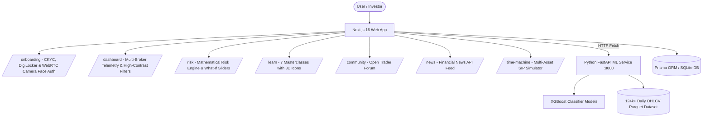

# Unify — All Your Investments, In One Place 🚀

> **Hack On Track 2026 Project** | Unified Investment Telemetry, Government CKYC Onboarding, Live Biometric Face Auth, XGBoost Machine Learning Stock Insights, Risk Analytics, Interactive Financial Masterclasses & Trader Community.

[](https://nextjs.org/)
[](https://www.typescriptlang.org/)
[](https://fastapi.tiangolo.com/)
[](https://xgboost.readthedocs.io/)
[](https://tailwindcss.com/)
[](https://www.prisma.io/)

---

## 📌 Executive Summary & Problem Statement

Indian retail investors face severe fragmentation across multiple brokerage accounts (**Zerodha, Groww, Upstox, Angel One, ICICI Direct**). This fragmentation leads to:

1. **Duplicate Depository Charges**: Holding identical scrips across multiple brokers drains capital via hidden annual DP fees (₹420/yr leak per duplicated scrip).
2. **Opaque Overall Risk Profile**: Inability to compute real portfolio volatility, Herfindahl-Hirschman asset concentration, and Value-at-Risk (VaR) across accounts.
3. **Speculative Decision Making**: Reliance on social media noise rather than statistical ML price direction insights and quantitative indicators.
4. **Financial Literacy Gap**: Complex asset classes (REITs, InvITs, Debt Bonds, ETFs, Futures & Options) are poorly understood by retail investors.

### 💡 The Unify Solution
**Unify** consolidates all investment telemetry under a single unified dashboard, paired with **Government CKYC & Live Biometric Face Verification**, an **XGBoost Machine Learning prediction engine**, real-time **Financial News Stream**, a **Mathematical Portfolio Risk Engine**, **Interactive Masterclasses with Custom 3D Icons**, and an **Open Trader Community Forum**.

---

## ✨ Core Features & Platform Architecture

### 1. 🆔 CKYC & Biometric Identity Onboarding (`/onboarding`)
- **Step 1: Investor Profile**: Collects name, age, phone, email, address with keyboard `<Enter>` key navigation.
- **Step 2: NSDL PAN Verification**: Real-time NSDL Depository PAN lookup featuring the official NSDL logo.
- **Step 3: Mobile OTP Authentication**: 6-digit OTP verification with instant demo support.
- **Step 4: Government DigiLocker & UIDAI Aadhaar CKYC**: Redirects to `digilocker.gov.in` for authorized CKYC retrieval featuring official UIDAI Aadhaar logo.
- **Step 5: WebRTC Camera Live Biometric Face Auth**: Real device camera access, face mesh overlay, laser liveness scanning, and biometric hash match against UIDAI Aadhaar photo.
- **Step 6: Broker Portal Selection & P&L Upload**:
  - Interactive checkboxes for partnered (`Zerodha`, `Groww`, `Upstox`, `CDSL`) and un-integrated (`Angel One`, `ICICI Direct`) brokerages.
  - **Client-Side P&L File Content Validation**: FileReader inspection checking file format (`.pdf`, `.csv`, `.xlsx`) and financial keywords (`P&L`, `Tax`, `CAS`, `Contract Note`, `Holdings`, `ISIN`). Throws clear error alerts for invalid/random file uploads.
  - **Step-by-Step P&L Download Guide Modal**: Click-by-click instructions for downloading P&L statements across Zerodha, Groww, Upstox, Angel One, and ICICI Direct.
  - **Gmail Trade Mail Parser Sync**: Read-only order contract note auto-sync consent.
- **Steps 7 & 8: Trader Classification Questionnaire**: Classifies investors into **Fresher**, **Beginner**, **Intermediate**, **Advanced**, or **Pro Trader** based on risk reaction, analysis methodology, and asset experience.

---

### 2. 📊 Unified Portfolio Dashboard (`/dashboard`)
- **Multi-Broker Telemetry**: Aggregates net portfolio value, unrealized gain/loss, and positions across Zerodha, Groww, Upstox, and CDSL.
- **High-Contrast Broker Filter Pills**: Active purple pills with crystal-clear white text and official broker logo badges (`/logos/zerodha.webp`, `/logos/groww.png`, `/logos/upstox.png`, `/logos/cdsl.webp`, `/logos/unify.png`).
- **Cross-Broker Overlap Alert**: Flags duplicate holdings across brokerages, calculating annual DP fee leakage.
- **Prominent Prediction & Time Machine Widgets**: Quick stock ML insights and historical SIP compounding simulator directly on the main dashboard.
- **Capital Invested & Asset Allocation**: Recharts allocation donut chart with Net Worth center and detailed capital distribution table.

---

### 3. 📚 Interactive Masterclasses (`/learn`)
- **7 Core Asset Classes**: Dedicated masterclass modules for **Stocks**, **Mutual Funds**, **ETFs**, **Bonds**, **REITs**, **InvITs**, and **Futures & Options (F&O)**.
- **Minimalist 3D App Icon Badges**: Topic-focused minimalist 3D icons (`/logos/stocks.jpg`, `/logos/mutual-funds.jpg`, `/logos/etfs.jpg`, `/logos/bonds.jpg`, `/logos/reits.jpg`, `/logos/invits.jpg`, `/logos/fno.jpg`).
- **Simulators & Knowledge Checks**: Plain-language breakdowns, virtual AI mentors, risk-free interactive return range sliders, and MCQ challenges with immediate feedback rationales.

---

### 4. 🤖 XGBoost ML Stock Prediction Engine (`/prediction`)
- **Python FastAPI Service**: Independent machine learning backend trained on **124,000+ daily OHLCV price records** across 50 Indian stocks.
- **Strict Time-Series Validation**: Chronological 80/20 train/test split with zero future data leakage.
- **Engineered Technical Features**: Lagged returns (`return_1d`, `return_5d`), moving average ratios (`ma_10`, `ma_50`), 20-day annualized volatility (`volatility_20`), 14-day RSI (`rsi_14`), and volume changes.
- **Evaluation vs Naïve Baseline**: Reports test accuracy, precision, recall, F1-score, ROC-AUC, feature importances, and test confusion matrix.

---

### 5. 🛡️ Portfolio Risk Engine (`/risk`)
- **0–100 Mathematical Risk Score**: Combines 1-year Annualized Volatility (40%), HHI Concentration (30%), and Max Drawdown (30%).
- **Interactive "What-If" Allocation Engine**: Shift stock allocation into fixed-income bonds via live sliders to see simulated reductions in volatility, max drawdown, and overall risk score.
- **1-Month Value at Risk (95% VaR)**: Calculates maximum estimated loss at 95% confidence level.

---

### 6. 🌐 Open Trader Community Portal (`/community`)
- **Professional Trader Discussion Forum**: Category-tagged discussion threads for traders to post queries, discuss market insights, and receive guidance from senior community members.
- **Filter by Trader Experience**: Filter posts by experience levels (*Fresher, Beginner, Intermediate, Advanced, Pro*).

---

### 7. 📰 Financial Market News Stream (`/news`)
- **Curated Established Publications**: Aggregates live headlines from **Times of India (Business), Economic Times, Moneycontrol, Financial Express, and Reuters**.
- **Market Sentiment Signals**: Tagged with directional indicators (`BULLISH` / `BEARISH` / `NEUTRAL`), impact levels, and publication source filters.

---

### 8. ⏰ Time Machine Historical Simulator (`/time-machine`)
- **Multi-Asset Historical Simulator**: Simulates Lump Sum and Monthly SIP compounding growth across Stocks, Bonds, REITs, InvITs, and Mutual Funds.
- **Comprehensive Analytics**: Computes CAGR, Drawdown Profile (Pain Index), and Calendar Year Returns.

---

### 9. 💬 Unify AI Assistant (`/api/chat`)
- **Context-Aware Financial LLM**: Floating chat assistant connected to `/api/chat` streaming answers on portfolio state, risk scores, tax rules (STCG/LTCG), and ML predictions.

---

## 🏆 Judge Evaluation Guide

| Step | Page / Section | Feature / What to Inspect |
| :--- | :--- | :--- |
| **1. Intro & Onboarding** | `/onboarding` | Test 5-step CKYC onboarding: Enter details, test **NSDL PAN**, **DigiLocker**, **Live WebRTC Camera Face Auth**, **Broker Checkboxes & P&L Upload Validation**, and **Knowledge Quiz**. |
| **2. Overview** | `/dashboard` | Check Net Portfolio value, **High-Contrast Broker Filter Pills**, Asset Allocation breakdown, and **Cross-Broker Overlap warning banner**. |
| **3. AI Predictions** | `/prediction` | Select symbols (e.g. `RELIANCE`, `TCS`). View the XGBoost positive return probability, feature importances, accuracy vs baseline, and confusion matrix. |
| **4. Risk Engine** | `/risk` | Inspect the Overall Risk Score (0-100). Use the **"What-If" slider** to shift allocation to bonds and observe the live reduction in volatility and drawdown. |
| **5. Masterclasses** | `/learn` | View the **3D Icon Badges** for all 7 asset classes (Stocks, Mutual Funds, ETFs, Bonds, REITs, InvITs, F&O). Try the **Interactive Return Slider** and **MCQ Challenge**. |
| **6. Trader Forum** | `/community` | View trader threads, filter by experience level (*Fresher*, *Pro*), and post a new query. |
| **7. Account Sync** | `/accounts` | Click **"+ Connect New Broker"** to add an account. Test **Sync Now**, view mapped holdings drawers, and test the CAS Mail Sync scanner. |
| **8. Historical Sim** | `/time-machine` | Select asset classes (Equities, Bonds, REITs), pick dates, and toggle between **Lump Sum** and **Monthly SIP**. |
| **9. AI Assistant** | Floating Bubble | Click the bottom-right purple icon. Ask: *"How is my risk score calculated?"* or *"What is the difference between REITs and InvITs?"* |

---

## 💻 Tech Stack & System Architecture



- **Frontend**: Next.js 16 (App Router), TypeScript, Tailwind CSS v4, Framer Motion, Recharts, Lucide Icons.
- **Backend ML Service**: Python 3.9+, FastAPI, XGBoost, pandas, scikit-learn.
- **Database & Storage**: Prisma ORM, SQLite (`dev.db`), Apache Parquet (`stocks_processed.parquet`).

---

## 🛠️ Local Installation & Setup

### Prerequisites
- Node.js 18+ & `npm`
- Python 3.9+ & `pip`

### Step 1: Clone Repository
```bash
git clone https://github.com/aadiitya2007/Hack_On_Tracks.git
cd Hack_On_Tracks
```

### Step 2: Install Node.js Dependencies & Setup Database
```bash
npm install
npx prisma generate
npx prisma db push --accept-data-loss
npx tsx scripts/seed-prod.ts
```

### Step 3: Setup Python Environment & Train ML Models
```bash
# Create & activate virtual environment
python3 -m venv data_venv
source data_venv/bin/activate

# Install Python packages
pip install -r ml-service/requirements.txt

# Retrain XGBoost models on historical Parquet dataset
cd ml-service
python train.py
cd ..
```

### Step 4: Run Application

**Terminal 1: Start Next.js App**
```bash
npm run dev
```
*App will run at `http://localhost:3000`*

**Terminal 2: Start FastAPI ML Service**
```bash
source data_venv/bin/activate
cd ml-service
uvicorn main:app --host 0.0.0.0 --port 8000
```
*FastAPI ML Service will run at `http://localhost:8000`*

---

## 📐 Risk Engine Mathematics

The Portfolio Risk Score ($0 \le R \le 100$) is computed in `src/lib/risk-analytics.ts`:

$$R = 0.40 \cdot S_{\text{vol}} + 0.30 \cdot S_{\text{conc}} + 0.30 \cdot S_{\text{drawdown}} + \text{Penalty}$$

1. **Annualized Volatility ($S_{\text{vol}}$)**: Calculated using the portfolio covariance matrix ($\mathbf{w}^T \mathbf{\Sigma} \mathbf{w}$) scaled to 252 trading days:
   $$\sigma_{\text{ann}} = \sqrt{252 \cdot \mathbf{w}^T \mathbf{\Sigma} \mathbf{w}}$$
2. **Herfindahl-Hirschman Index ($S_{\text{conc}}$)**: Concentration index measuring asset over-exposure:
   $$\text{HHI} = \sum_{i=1}^{N} w_i^2$$
3. **Maximum Drawdown ($S_{\text{drawdown}}$)**: Peak-to-trough decline across historical equity curves.
4. **95% Value at Risk (VaR)**: Parametric 1-month maximum loss at 95% confidence:
   $$\text{VaR}_{95\%} = \text{Portfolio Value} \cdot 1.645 \cdot \sigma_{\text{daily}} \cdot \sqrt{21}$$

---

## 🛡️ Compliance & Disclaimer
Unify is an experimental fintech prototype developed for **Hack On Track 2026**. All predictions, risk scores, and simulations are statistical and educational. The platform does not provide SEBI-registered financial advice.
