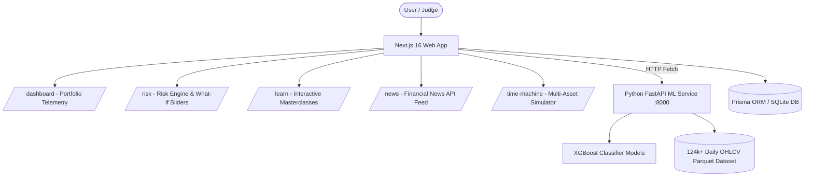

# Unify — All Your Investments, In One Place 🚀

> **Hack On Track 2026 Submission** | Unified Investment Telemetry, Machine Learning Stock Insights, Risk Analytics & Interactive Financial Masterclasses.

[](https://nextjs.org/)
[](https://www.typescriptlang.org/)
[](https://fastapi.tiangolo.com/)
[](https://xgboost.readthedocs.io/)
[](https://tailwindcss.com/)
[](https://www.prisma.io/)

---

## 📌 Executive Summary & The Problem

Indian retail investors face severe fragmentation across multiple brokerage accounts (**Zerodha, Groww, Upstox, Angel One, ICICI Direct**). This fragmentation results in:
1. **Duplicate DP Charges**: Holding identical scrips across accounts drains capital through hidden depository fees.
2. **Opaque Overall Risk**: Inability to calculate real portfolio volatility, asset concentration, and Value-at-Risk (VaR) across accounts.
3. **Speculative Decision Making**: Lack of statistical price direction insights and reliance on hype rather than data-driven technical indicators.
4. **Financial Literacy Gap**: Complex asset classes (REITs, InvITs, Debt Funds, ETFs) are poorly understood by retail investors.

### 💡 The Unify Solution
**Unify** consolidates all your investment telemetry under a single dashboard, paired with an **XGBoost Machine Learning prediction engine**, real-time **Financial News feed from Times of India, Economic Times & Reuters**, a **Mathematical Risk Engine**, and **Interactive Learning Masterclasses** for Indian markets.

---

## ✨ Core Features & Modules

### 1. 📊 Unified Portfolio Dashboard (`/dashboard`)
- **Multi-Broker Telemetry**: Aggregates holdings, total net worth, unrealized P&L, and XIRR across Zerodha, Groww, Upstox, Angel One, and ICICI Direct.
- **Cross-Broker Overlap Alert**: Automatically flags duplicate holdings across brokerages, calculating annual DP fee leakage.
- **Asset Allocation Telemetry**: Recharts pie & trajectory graphs cross-indexed across Equities, Mutual Funds, Bonds, REITs, and InvITs.

### 2. 🤖 XGBoost ML Stock Prediction Engine (`/prediction`)
- **Python FastAPI Service**: Independent machine learning backend trained on **124,000+ daily OHLCV price records** across 50 Indian stocks.
- **Strict Time-Series Validation**: Chronological 80/20 train/test split with **zero future data leakage**.
- **Engineered Technical Features**: Lagged returns (`return_1d`, `return_5d`), moving average ratios (`ma_10`, `ma_50`), 20-day annualized volatility (`volatility_20`), 14-day RSI (`rsi_14`), and volume changes.
- **Evaluation vs Naïve Baseline**: Reports test accuracy, precision, recall, F1-score, ROC-AUC, feature importances, and test confusion matrix.

### 3. 📰 Financial Market News Stream (`/news`)
- **Curated Established Publications**: Aggregates live headlines from **Times of India (Business), Economic Times, Moneycontrol, Financial Express, and Reuters**.
- **Market Sentiment Signals**: Tagged with directional indicators (`BULLISH` / `BEARISH` / `NEUTRAL`), impact levels, and publication source filters.

### 4. 🛡️ Portfolio Risk Engine (`/risk`)
- **0–100 Mathematical Risk Score**: Combines 1-year Annualized Volatility (40%), HHI Concentration (30%), and Max Drawdown (30%).
- **Interactive "What-If" Allocation Engine**: Shift stock allocation into fixed-income bonds via live sliders to see simulated reductions in volatility, max drawdown, and overall risk score.
- **1-Month Value at Risk (95% VaR)**: Calculates maximum estimated loss at 95% confidence level.

### 5. 🏦 Accounts & CAS Mail Sync (`/accounts`)
- **Live API Accounts**: Manage connected broker credentials with instant sync and disconnect capabilities.
- **Automated CAS Mail Sync**: Privacy-first, read-only PDF/contract note parser for un-integrated brokerages.

### 6. ⏰ Time Machine Historical Engine (`/time-machine`)
- **Multi-Asset Historical Simulator**: Simulates Lump Sum and Monthly SIP compounding growth across Stocks, Bonds, REITs, InvITs, and Mutual Funds.
- **Comprehensive Analytics**: Computes CAGR, Drawdown Profile (Pain Index), and Calendar Year Returns.

### 7. 📚 Interactive Academy (`/learn`)
- **6 Comprehensive Masterclasses**: Deep dives into **Stocks, Mutual Funds, ETFs, Bonds, REITs, and InvITs** with exact India market statistics.
- **Interactive Return Simulator**: Test custom initial investment amounts and observe Bullish vs Bearish outcome ranges.
- **Interactive MCQ Challenges**: Quiz questions with immediate explanation rationales.

### 8. 💬 Unify AI Assistant (`/api/chat`)
- **Context-Aware Financial LLM**: Embedded floating chat widget connected to `/api/chat` streaming answers character-by-character on portfolio state, risk scores, tax rules (STCG/LTCG), and ML predictions.

---

## 🏆 Judge Evaluation Guide

To evaluate the platform, follow this recommended walkthrough:

| Step | Page / Section | What to Look For |
| :--- | :--- | :--- |
| **1. Overview** | `/dashboard` | Check consolidated Net Portfolio value, Asset Allocation pie chart, Cross-Broker Overlap warning banner, and live telemetry badges. |
| **2. AI Predictions** | `/prediction` | Select symbols (e.g. `RELIANCE`, `TCS`). View the XGBoost positive return probability, feature importances, accuracy vs baseline, and confusion matrix. |
| **3. Financial News** | `/news` | Filter stories by publication source (*Times of India, Economic Times, Moneycontrol, Financial Express, Reuters*) and market sentiment signals. |
| **4. Risk Engine** | `/risk` | Inspect the Overall Risk Score (0-100). Use the **"What-If" slider** to shift allocation to bonds and observe the live reduction in volatility and drawdown. |
| **5. Account Sync** | `/accounts` | Click **"+ Connect New Broker"** to add an account. Test **Sync Now**, view mapped holdings drawers, and test the CAS Mail Sync scanner. |
| **6. Historical Sim** | `/time-machine` | Select asset classes (Equities, Bonds, REITs), pick dates, and toggle between **Lump Sum** and **Monthly SIP**. |
| **7. Masterclass** | `/learn` | Click into **Stocks**, **Mutual Funds**, or **ETFs**. Try the **Interactive Return Slider** and test the **MCQ Challenge**. |
| **8. AI Assistant** | Floating Bubble | Click the bottom-right purple icon. Ask: *"How is my risk score calculated?"* or *"What is the difference between REITs and InvITs?"* |

---

## 💻 Tech Stack & Architecture



- **Frontend**: Next.js 16 (App Router), TypeScript, Tailwind CSS v4, Framer Motion, Recharts, Lucide Icons.
- **Backend ML Service**: Python 3.9+, FastAPI, XGBoost, pandas, scikit-learn.
- **Database & Storage**: Prisma ORM, SQLite (`dev.db`), Apache Parquet (`stocks_processed.parquet`).

---

## 🛠️ Local Installation & Setup

### Prerequisites
- Node.js 18+ & `npm`
- Python 3.9+ & `pip`

### Step 1: Clone Repository
```bash
git clone https://github.com/aadiitya2007/Hack_On_Tracks.git
cd Hack_On_Tracks
```

### Step 2: Install Node.js Dependencies & Setup Database
```bash
npm install
npx prisma generate
npx prisma db push --accept-data-loss
npx tsx scripts/seed-prod.ts
```

### Step 3: Setup Python Environment & Train ML Models
```bash
# Create & activate virtual environment
python3 -m venv data_venv
source data_venv/bin/activate

# Install Python packages
pip install -r ml-service/requirements.txt

# Retrain XGBoost models on historical Parquet dataset
cd ml-service
python train.py
cd ..
```

### Step 4: Run Application

**Terminal 1: Start Next.js App**
```bash
npm run dev
```
*App will run at `http://localhost:3000`*

**Terminal 2: Start FastAPI ML Service**
```bash
source data_venv/bin/activate
cd ml-service
uvicorn main:app --host 0.0.0.0 --port 8000
```
*FastAPI ML Service will run at `http://localhost:8000`*

---

## 📐 Risk Engine Formula & Mathematics

The Portfolio Risk Score ($0 \le R \le 100$) is computed in `src/lib/risk-analytics.ts`:

$$R = 0.40 \cdot S_{\text{vol}} + 0.30 \cdot S_{\text{conc}} + 0.30 \cdot S_{\text{drawdown}} + \text{Penalty}$$

1. **Annualized Volatility ($S_{\text{vol}}$)**: Calculated using the portfolio covariance matrix ($\mathbf{w}^T \mathbf{\Sigma} \mathbf{w}$) scaled to 252 trading days:
   $$\sigma_{\text{ann}} = \sqrt{252 \cdot \mathbf{w}^T \mathbf{\Sigma} \mathbf{w}}$$
2. **Herfindahl-Hirschman Index ($S_{\text{conc}}$)**: Concentration index measuring asset over-exposure:
   $$\text{HHI} = \sum_{i=1}^{N} w_i^2$$
3. **Maximum Drawdown ($S_{\text{drawdown}}$)**: Peak-to-trough decline across historical equity curves.
4. **95% Value at Risk (VaR)**: Parametric 1-month maximum loss at 95% confidence:
   $$\text{VaR}_{95\%} = \text{Portfolio Value} \cdot 1.645 \cdot \sigma_{\text{daily}} \cdot \sqrt{21}$$

---

## 🌐 API Endpoints Reference

| Endpoint | Method | Description |
| :--- | :--- | :--- |
| `/api/diagnostics` | `GET` | Health check, DB connectivity, row counts, and active environment flags. |
| `/api/news` | `GET` | Aggregated financial news feed with sentiment signals (`BULLISH`/`BEARISH`/`NEUTRAL`). |
| `/api/chat` | `POST` | Financial AI Assistant endpoint for streaming context-aware answers. |
| `http://localhost:8000/predict/{symbol}` | `GET` | ML model next-day directional probability & signal. |
| `http://localhost:8000/metrics/{symbol}` | `GET` | ML model evaluation metrics vs baseline & confusion matrix. |

---

## 🛡️ Compliance & Disclaimer
Unify is an experimental fintech prototype developed for **Hack On Track 2026**. All predictions, risk scores, and simulations are statistical and educational. The platform does not provide SEBI-registered financial advice.
